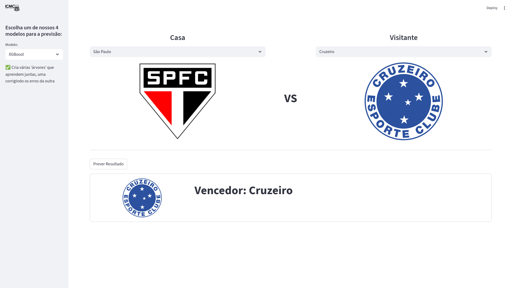
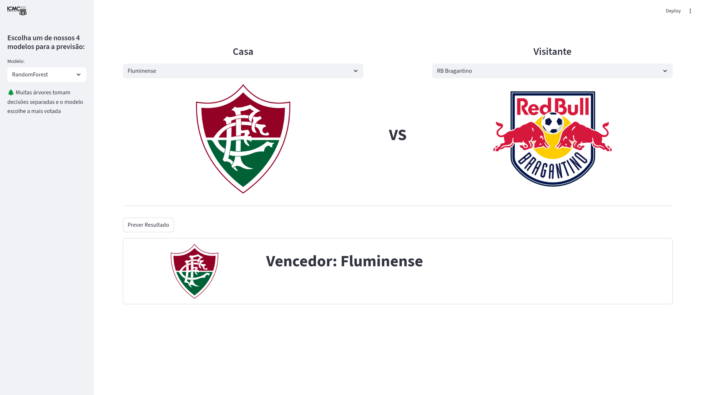
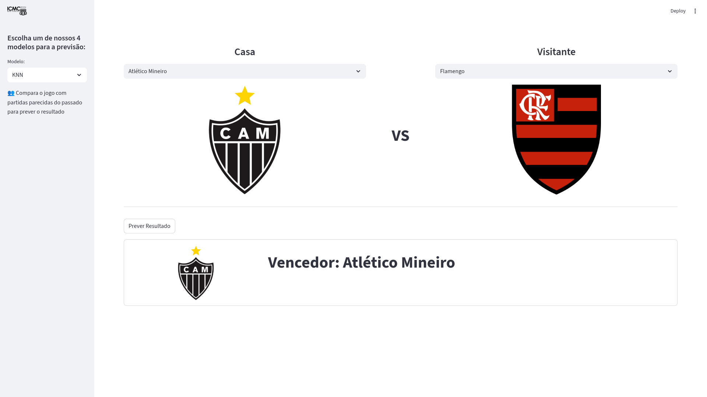

# SCC0230 — Inteligência Artificial
## Previsão de Partidas de Futebol — Campeonato Brasileiro Série A

> Projeto desenvolvido para a disciplina SCC0230 — Inteligência Artificial  
> Instituto de Ciências Matemáticas e de Computação — ICMC/USP, 2025

### Integrantes

| Nome | NUSP |
|------|------|
| Arthur Trottmann Ramos | 14681052 |
| Didrick Chancel Lignina Ndombi | 14822368 |
| Henrique Drago | 14675441 |
| Henrique Yukio Sekido | 14614564 |
| Karl Cruz Altenhofen | 14585976 |
| Maicon Chaves Marques | 14593530 |

---

## Descrição do Projeto

Este projeto aplica técnicas de Aprendizado de Máquina (ML) para prever o resultado de partidas do **Campeonato Brasileiro Série A**. O objetivo é classificar o resultado de cada partida em três possíveis desfechos do ponto de vista do time da casa:

- **Vitória da casa (W)**
- **Empate (D)**
- **Derrota da casa (L)**

O pipeline completo cobre desde a coleta automatizada de dados até a disponibilização de uma interface web interativa para consulta das previsões.

---

## Estrutura do Repositório

```
.
├── campeonatos/
│   ├── matches_2020.csv
│   ├── matches_2021.csv
│   ├── matches_2022.csv
│   ├── matches_2023.csv
│   ├── matches_2024.csv
│   └── matches_2025.csv
├── IA_fbref.ipynb          # Notebook com pré-processamento e treinamento
├── app.py                  # Aplicação Streamlit
├── xgboost_model.pkl
├── random_forest.pkl
├── regressao.pkl
├── knn.pkl
├── home_df_minmax.csv
├── away_df_minmax.csv
├── requirements.txt
├── environment.yml
└── README.md
```

---

## 1. Extração de Dados

Os dados foram coletados via **webscraping do site [FBref](https://fbref.com)**, que disponibiliza estatísticas detalhadas de partidas de futebol ao redor do mundo.

Foram raspadas partidas do Campeonato Brasileiro Série A das seguintes temporadas:

> **2020 · 2021 · 2022 · 2023 · 2024 · 2025**

Para cada partida, foram coletadas as seguintes informações:

| Campo | Descrição |
|-------|-----------|
| `Home` / `Away` | Time da casa e visitante |
| `Score` | Placar final da partida |
| `xG_H` / `xG_A` | Expected Goals (gols esperados) para cada time |
| `Possession_H/A` | Posse de bola (%) |
| `PassCompleted_H/A` | Passes completos |
| `PassTotal_H/A` | Total de passes tentados |
| `ShotsTarget_H/A` | Finalizações no gol |
| `ShotsTotal_H/A` | Total de finalizações |
| `SaveCompleted_H/A` | Defesas realizadas |
| `SaveTotal_H/A` | Total de defesas tentadas |
| `Corners_H/A` | Escanteios |

O dataset resultante contém **~2200 partidas** no total.

**Distribuição dos resultados (3 labels):**
- Vitória da casa: **46%**
- Empate: **27%**
- Derrota da casa (vitória visitante): **27%**

**Distribuição alternativa (2 labels):**
- Vitória da casa: **46%**
- Não-vitória da casa: **54%**

---

## 2. Pré-processamento

O notebook `IA_fbref.ipynb` realiza todo o pipeline de preparação dos dados.

### 2.1 Carregamento e Ordenação

Os CSVs de cada temporada são carregados e concatenados em um único DataFrame, depois **ordenados cronologicamente** pela coluna `Date` — etapa fundamental para garantir que as médias móveis e a divisão treino/teste respeitem a ordem temporal.

```python
df['Date'] = pd.to_datetime(df['Date'])
df = df.sort_values(by='Date')
```

### 2.2 Remoção de Colunas

Colunas com baixo valor preditivo ou que poderiam causar vazamento de dados foram removidas:

```python
df = df.drop(columns=['Week', 'Fouls_H', 'Fouls_A', 'Crosses_H', 'Crosses_A',
    'Touches_H', 'Touches_A', 'Tackles_H', 'Tackles_A', 'Interceptions_H',
    'Interceptions_A', 'Aerials_H', 'Aerial_A', 'Clearances_H', 'Clearances_A',
    'Offsides_H', 'Offsides_A', 'Goal_Kicks_H', 'Goal_Kicks_A',
    'Throw_Ins_H', 'Throw_Ins_A', 'Long_Balls_H', 'Long_Balls_A',
    'Referee', 'Venue', 'Attendance'])
```

### 2.3 Conversão de Tipos

- `Possession_H/A`: convertido de string (`"56%"`) para float numérico
- `Score`: parseado para extrair gols de cada time e gerar as labels `W`, `D`, `L`
- `Time`: convertido para hora inteira e categorizado em períodos do dia

### 2.4 Feature Engineering

Foram criadas diversas features derivadas para capturar o histórico e a forma recente dos times:

**Médias Móveis Gerais (todas as partidas anteriores do time):**
- `Home_General_Avg_xG` — média de xG do time da casa
- `Away_General_Avg_xG` — média de xG do visitante
- `Away_General_Avg_Conceding_gols` — média de gols sofridos pelo visitante
- `Home_General_Avg_Possession` — média de posse de bola da casa
- `Home/Away_General_Avg_ShotsTotal`, `ShotsTarget`, `PassTotal`

**Médias Móveis Contextuais (casa/fora separados):**
- `Average_Score_gols_H/A` — média de gols marcados jogando em casa/fora
- `Average_Conceding_gols_H/A` — média de gols sofridos em casa/fora
- `Average_xG_H/A`, `Average_ShotsTotal_H/A`, `Average_ShotsTarget_H/A`
- `Average_PassTotal_H/A`, `Average_Possession_H/A`, `Average_Corners_H/A`

**Métricas Derivadas:**
- `Home_Defense_Solidity` — solidez defensiva do time da casa
- `Away_Score_gols_Efficiency` — eficiência ofensiva do visitante
- `Home_Recent_Form` / `Away_Recent_Form` — forma recente (últimas partidas)
- `Form_Diff` — diferença de forma entre os times

**Encoding Categórico:**
- One-hot encoding do horário → `Match_Period_Morning`, `Match_Period_Afternoon`, `Match_Period_Evening`

O DataFrame final possui **68 colunas** de features após todo o processamento.

### 2.5 Normalização

Os dados numéricos foram normalizados com **MinMaxScaler** para garantir comparabilidade entre features e melhor desempenho em modelos sensíveis à escala.

### 2.6 Divisão Treino/Teste

A divisão respeita a ordem temporal — os dados mais antigos são usados para treino e os mais recentes para teste — usando **`TimeSeriesSplit` com 5 folds**, evitando qualquer vazamento de informação futura.

---

## 3. Modelos de Machine Learning

Foram treinados e comparados **4 modelos supervisionados**, cada um representando uma abordagem diferente de aprendizado:

### 3.1 XGBoost *(Simbólico — Ensemble de Árvores com Boosting)*

> Cria várias 'árvores' que aprendem juntas, corrigindo os erros umas das outras.

O XGBoost foi otimizado com **Optuna** (60 trials de busca bayesiana de hiperparâmetros):

```python
params = {
    'n_estimators': trial.suggest_int('n_estimators', 100, 600),
    'learning_rate': trial.suggest_float('learning_rate', 0.005, 0.2, log=True),
    'max_depth': trial.suggest_int('max_depth', 3, 8),
    'subsample': trial.suggest_float('subsample', 0.6, 1.0),
    'colsample_bytree': trial.suggest_float('colsample_bytree', 0.6, 1.0),
    'min_child_weight': trial.suggest_int('min_child_weight', 1, 10),
    'reg_alpha': trial.suggest_float('reg_alpha', 1e-5, 10, log=True),   # L1
    'reg_lambda': trial.suggest_float('reg_lambda', 1e-5, 10, log=True)  # L2
}
```

Melhores parâmetros encontrados: `n_estimators=241`, `learning_rate=0.005`, `max_depth=7`

**Resultado (interface):**


---

### 3.2 Random Forest *(Simbólico — Ensemble de Árvores com Bagging)*

Também otimizado com **Optuna**, o Random Forest constrói múltiplas árvores de decisão independentes e agrega seus votos para a classificação final.

**Resultado (interface):**


---

### 3.3 Regressão Logística *(Estatístico)*

Modelo linear otimizado via **GridSearchCV** com `TimeSeriesSplit` (5 folds, 100 fits totais):

```python
param_grid = {
    'C': [0.001, 0.01, 0.1, 1, 10],
    'penalty': ['l1', 'l2'],
    'class_weight': [None, 'balanced']
}
```

- Melhores parâmetros (3 labels): `C=0.1`, `penalty='l2'`, `class_weight=None`
- Melhores parâmetros (2 labels): `C=0.01`, `penalty='l2'`, `class_weight='balanced'`

**Resultado (interface):**


---

### 3.4 KNN — K-Nearest Neighbors *(Baseado em Instâncias)*

O KNN foi testado com todos os valores de `k` entre 2 e 39. Os melhores valores encontrados foram:
- `k=36` para 3 labels (acurácia ~52%)
- `k=27` para 2 labels (acurácia ~57%)

**Resultado (interface):**


---

## 4. Resultados e Avaliação

### Acurácia com 3 Labels (Vitória / Empate / Derrota)

| Modelo | Acurácia no Teste |
|--------|:-----------------:|
| XGBoost | **51%** |
| Random Forest | **51%** |
| Regressão Logística | **51%** |
| KNN | **45%** |

> Baseline aleatório para 3 classes: ~33%

### Acurácia com 2 Labels (Vitória da casa / Não-vitória)

| Modelo | Acurácia no Teste |
|--------|:-----------------:|
| Random Forest | **60%** |
| XGBoost | **57%** |
| Regressão Logística | **57%** |
| KNN | **57%** |

> Baseline aleatório para 2 classes: ~50%

### Features Mais Importantes

De acordo com a análise de importância de features (XGBoost e Random Forest), as variáveis com maior poder preditivo foram:

**XGBoost — Top features:**
1. `Home_General_Avg_xG` — xG médio geral do time da casa
2. `Away_General_Avg_xG` — xG médio geral do visitante
3. `Away_General_Avg_Conceding_gols` — média de gols sofridos pelo visitante
4. `Average_PassTotal_H` — total médio de passes da casa
5. `Average_ShotsTarget_H` — chutes a gol médios da casa
6. `Home_General_Avg_SaveTotal` — defesas médias da casa
7. `Average_Conceding_gols_H` — gols sofridos médios da casa

**Random Forest — Top features:**
1. `Home_General_Avg_Possession` — posse de bola média da casa
2. `Average_PassTotal_H`
3. `Away_General_Avg_xG`
4. `Home_General_Avg_xG`
5. `Away_General_Avg_PassTotal`
6. `Home_General_Avg_PassTotal`
7. `Away_General_Avg_ShotsTotal`

---

## 5. Discussão dos Resultados

O futebol é intrinsecamente difícil de prever. Alguns fatores que limitam a acurácia dos modelos:

- **Mesmo times superiores em estatísticas podem perder** — fatores aleatórios têm grande peso
- **As estatísticas históricas nem sempre explicam o placar de uma partida específica**
- **O Campeonato Brasileiro é particularmente equilibrado**, com grande paridade entre os times

As acurácias obtidas são superiores ao baseline aleatório e condizentes com a literatura de previsão de futebol. O modelo de 2 labels (vitória vs. não-vitória) mostrou resultados mais robustos, chegando a 60% com Random Forest.

---

## 6. Interface Web (Streamlit)

Foi desenvolvida uma interface web com o framework **Streamlit** que permite:

- Escolher o **time da casa** e o **time visitante** via dropdown com os escudos dos clubes
- Selecionar o **modelo de ML** desejado entre os 4 disponíveis
- Obter a **previsão do resultado** (3 labels) com exibição visual do vencedor previsto

---

## Como Rodar

### Opção 1 — Python (Pip) + Venv

```bash
git clone <url-do-repositório>
cd <pasta-do-projeto>
python -m venv venv
source venv/bin/activate      # Linux/Mac
# venv\Scripts\activate       # Windows
pip install -r requirements.txt
streamlit run app.py
```

### Opção 2 — Conda

```bash
git clone <url-do-repositório>
cd <pasta-do-projeto>
conda env create -f environment.yml
conda activate <nome-do-ambiente>
streamlit run app.py
```

Acesse no navegador: `http://localhost:8501`

---

## Dependências Principais

- `pandas`, `numpy` — manipulação e análise de dados
- `scikit-learn` — modelos ML, pré-processamento e avaliação
- `xgboost` — modelo XGBoost
- `optuna` — otimização bayesiana de hiperparâmetros
- `streamlit` — interface web interativa
- `matplotlib` — visualizações e gráficos
- `joblib` — serialização e carregamento de modelos

---

## Conclusões

O projeto demonstrou que é possível obter previsões acima do acaso para resultados de futebol utilizando apenas estatísticas históricas de partidas. Os modelos baseados em árvores (XGBoost e Random Forest) apresentaram os melhores resultados, especialmente na tarefa binária (2 labels).

O uso de **médias móveis contextuais** — separando estatísticas quando o time joga em casa versus fora — e **métricas de forma recente** foram essenciais para enriquecer o poder preditivo. As features de **xG (Expected Goals)** se destacaram como as mais informativas em ambos os modelos de árvore.

Como trabalhos futuros, seria interessante incorporar dados de escalações, lesões, confrontos diretos históricos e informações de mercado para potencialmente melhorar a acurácia das previsões.
